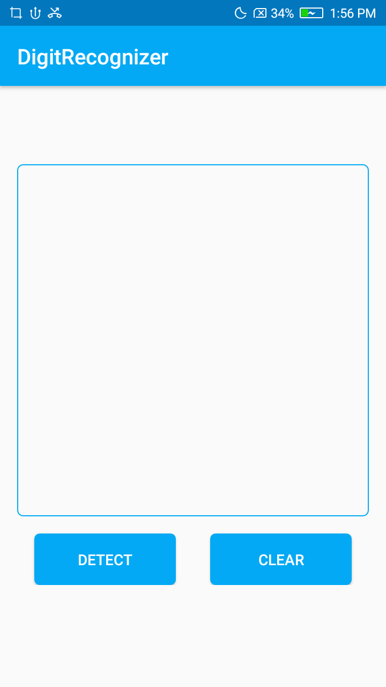

# DigitRecognizer
Kotlin Digit Recognition app with machine learning using tensorflow lite model created using Tensorflow in Python 3 .

*Machine learning model build in Tensorflow*

* dataset used : mnist dataset

* Model size : 5.56 MB
# *Screenshots*
   
